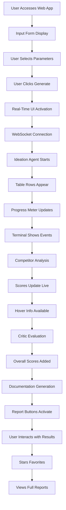

# Business Idea Generator Web Application v2.0 - Product Requirements Document

## Project Overview

### Purpose
This document outlines the requirements for transforming the Business Idea Generator from a command-line POC into a full-featured web application with real-time progress visualization. The system maintains its core multi-agent AI architecture while adding a dynamic, responsive user interface that showcases the agent orchestration process in real-time.

### Value Proposition
- **Real-Time Transparency**: Users can observe the AI agents' progress as ideas are generated, analyzed, and scored
- **Interactive Experience**: Dynamic interface with live updates, filtering, and detailed information access
- **Professional Workflow**: Streamlined process from idea generation to comprehensive business reports
- **Visual Intelligence**: Multi-dimensional scoring with hover-based reasoning display
- **Operational Efficiency**: Maintain all POC benefits while adding user-friendly web access

### High-Level Functionality
The web application processes user-defined business parameters through the existing four-agent system, providing real-time visual feedback via a smart table, progress meters, and streaming terminal output. Users can interact with results, star favorites, and access detailed reports through an intuitive interface.

## Functional Requirements

### FR1: User Input Interface
- **Seed Data Collection Form**:
  - Vertical selection (dropdown with hardcoded options)
  - Sub-vertical selection (dropdown filtered by selected vertical)
  - Business model selection (dropdown with hardcoded options)
  - Free text field for additional focus information (new feature)
  - "Generate Ideas" button to initiate the process
- Form validation to ensure all required fields are populated
- Clear visual feedback for field selection and validation states

### FR2: Smart Table (Core UI Component)
- **Central Table Display**:
  - Real-time row updates as agents process ideas
  - Each row represents one business idea
  - Columns include:
    - Star toggle (clickable, persists state)
    - Idea number
    - Name
    - Title
    - Score columns (all with one decimal place):
      - Overall Score (displayed first, calculated last)
      - Disruption Potential
      - Market Potential
      - Technical Complexity
      - Capital Intensity
      - Blue Ocean Score
    - Competitor Analysis (100 char preview with ellipsis)
    - Critical Analysis (100 char preview with ellipsis)
    - Full Report button (activates when available)
  
- **Interactive Elements**:
  - "More info" hover buttons on each score showing reasoning
  - Full content hover display for truncated analyses
  - Non-modal dialog for markdown report display
  - Filter toggle: Current run vs. Persisted ideas

### FR3: Agent Progress Dashboard
- **Metered Visualization**:
  - One meter per agent (Ideation, Competitor, Critic, Documentation)
  - Scale from 0 to 10 showing progress
  - Real-time updates based on backend events
  - Visual distinction between idle, active, and completed states
- Compact placement to avoid distracting from main content
- Clear agent labels and current status indicators

### FR4: Terminal Output Stream
- **Live Event Display**:
  - Terminal-style interface showing agent events
  - Scrollable text output with timestamps
  - Color-coded messages by agent type
  - Auto-scroll with manual scroll override
  - Clear/pause/resume controls
- Format: `[timestamp] [agent] message`

### FR5: Real-Time Backend Communication
- **WebSocket/SSE Implementation**:
  - Establish persistent connection on session start
  - Event types:
    - Agent status updates
    - Idea creation/update events
    - Score calculations
    - Analysis completions
    - Error notifications
  - Automatic reconnection on connection loss
  - Event buffering during disconnections

### FR6: Existing Agent System Integration
- Maintain all four agents from POC:
  - **Ideation Agent**: Generate 10 business ideas
  - **Competitor Agent**: Market analysis with Blue Ocean scoring
  - **Business Critic Agent**: Critical evaluation and Overall scoring
  - **Documentation Agent**: Report generation
- Backend orchestration remains sequential
- Event emission added at key processing points

## User Journey



### Input Stage
- Clean, modern form interface
- Intelligent dropdown filtering
- Optional free text for nuanced requirements
- Clear call-to-action button

### Processing Stage
- Three synchronized visualization components
- Real-time data flow from backend to frontend
- Progressive enhancement of displayed information
- No page refreshes required

### Output Stage
- Interactive table with full feature access
- Persistent starring mechanism
- Professional report viewing
- Filter between current and historical runs

## Data Models

### Frontend Event Structure
```typescript
interface AgentEvent {
  type: 'status' | 'idea_update' | 'score_update' | 'completion' | 'error';
  agentName: 'ideation' | 'competitor' | 'critic' | 'documentation';
  timestamp: string;
  data: {
    ideaId?: number;
    fieldUpdates?: Partial<BusinessIdea>;
    message?: string;
    progress?: number; // 0-10 scale
  };
}
```

### Enhanced Business Idea Model
```typescript
interface BusinessIdea {
  id: number;
  starred: boolean;
  title: string;
  name: string;
  description: string;
  businessModel: string;
  scores: {
    overall: number | null;
    disruption: number;
    market: number;
    technical: number;
    capital: number;
    blueOcean: number | null;
  };
  reasoning: {
    overall: string;
    disruption: string;
    market: string;
    technical: string;
    capital: string;
    blueOcean: string;
  };
  competitorAnalysis: string | null;
  criticalAnalysis: string | null;
  reportPath: string | null;
  lastUpdated: string;
}
```

### User Input Model
```typescript
interface IdeaGenerationRequest {
  vertical: string;
  subVertical: string;
  businessModel: string;
  additionalContext?: string; // New free text field
  sessionId: string;
}
```

## Technical Architecture

### Frontend Stack
- **Framework**: React 19.x (latest stable)
- **Build Tool**: Vite (latest stable)
- **UI Components**: shadcn/ui component library
- **Styling**: Tailwind CSS 4.x (latest stable)
- **State Management**: Real-time state updates from WebSocket events
- **Component Features**:
  - Data table with virtual scrolling for performance
  - Progress meter components (gauge/radial)
  - Terminal emulator component
  - Modal/dialog system

### Backend Enhancements
- **Event System**: 
  - Event emitter integration in agent orchestrator
  - Standardized event format
  - Event queuing for reliability
- **WebSocket/SSE Server**:
  - Connection management
  - Event broadcasting
  - Session handling
- **API Endpoints**:
  - POST /api/generate-ideas
  - GET /api/session/:id/status
  - GET /api/ideas/:id/report

### Communication Protocol
- WebSocket for bi-directional real-time updates
- REST API for initial requests and report retrieval
- Graceful fallback to polling if WebSocket fails

## UI/UX Guidelines

### Visual Design
- **Layout**: 
  - Smart table as central focus (60-70% of viewport)
  - Progress dashboard in sidebar or header
  - Terminal output in collapsible panel
- **Color Scheme**:
  - Consistent color coding for agents
  - Score-based color gradients (red-yellow-green)
  - Dark mode support
- **Typography**:
  - Clear hierarchy with distinct headers
  - Monospace font for terminal output
  - Readable body text for analyses

### Interaction Patterns
- **Hover States**: Smooth transitions for info display
- **Loading States**: Skeleton screens during data updates
- **Error Handling**: Clear error messages with recovery options
- **Responsive Design**: Mobile-friendly table with horizontal scroll

## Success Criteria

### Functional Success
- [ ] All POC functionality maintained
- [ ] Real-time updates visible within 100ms of backend events
- [ ] All interactive elements respond correctly
- [ ] Filter toggle works between current and persisted data
- [ ] Reports display correctly in non-modal dialogs

### Performance Success
- [ ] Initial page load under 3 seconds
- [ ] Real-time updates with <100ms latency
- [ ] Smooth scrolling with 100+ ideas in table
- [ ] No memory leaks during extended sessions

### User Experience Success
- [ ] Intuitive form with clear field relationships
- [ ] Visual feedback for all user actions
- [ ] Progress clearly communicated through multiple channels
- [ ] Easy access to detailed information without cluttering interface

## Constraints & Assumptions

### Technical Constraints
- Browser compatibility: Modern browsers only (Chrome, Firefox, Safari, Edge)
- No IE11 support required
- Maximum 100 concurrent users (local deployment)
- Test-cache used for persistence simulation

### Business Constraints
- No user authentication in this phase
- Local deployment only (no cloud hosting)
- English language only
- Fixed scoring dimensions from POC

### Assumptions
- Users have modern browsers with JavaScript enabled
- Network latency acceptable for local deployment
- Existing agent system requires minimal modification
- Test-cache provides adequate persistence simulation

## Out of Scope

### Current Phase Exclusions
- User authentication and authorization
- Database persistence (using test-cache only)
- User account management
- Idea editing or deletion
- Custom scoring criteria
- Export functionality beyond report viewing
- Multi-language support
- Cloud deployment
- Mobile native applications

### Future Considerations
- Full database integration
- User accounts with saved sessions
- Collaborative features
- API access for third-party integration
- Advanced filtering and search
- Batch idea generation
- Custom agent configuration
- Performance analytics dashboard

## Implementation Priorities

### Phase 1: Core Functionality
1. Basic web application setup
2. Input form implementation
3. WebSocket/SSE infrastructure
4. Smart table with real-time updates
5. Basic progress visualization

### Phase 2: Enhanced Interactivity
1. Hover information displays
2. Progress meter animations
3. Terminal output streaming
4. Report viewing in dialogs
5. Starring functionality

### Phase 3: Polish & Optimization
1. Responsive design refinement
2. Performance optimization
3. Error handling improvements
4. Loading state enhancements
5. Accessibility compliance

## Acceptance Criteria

### Definition of Done
1. **Input Collection**: Form validates and submits all required data
2. **Real-Time Updates**: All three visualization components update live
3. **Data Integrity**: All scores and analyses display correctly
4. **Interactivity**: All hover, click, and toggle features functional
5. **Performance**: Meets stated latency and load time requirements
6. **Quality**: No critical bugs, smooth user experience
7. **Documentation**: Code documented, user guide provided

### Testing Strategy
- Manual testing only for this phase
- Test checklist covering all user flows
- Browser compatibility verification
- Performance monitoring during development

---

*This PRD v2.0 represents the evolution from POC to production-ready web application, maintaining core AI capabilities while adding sophisticated real-time visualization and interaction features.*