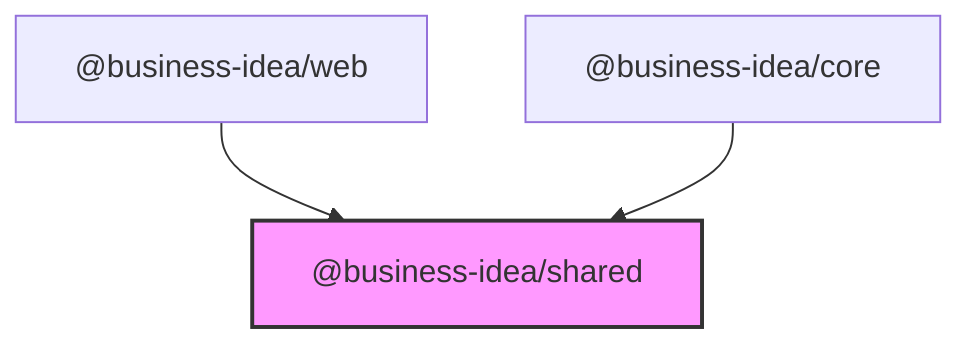
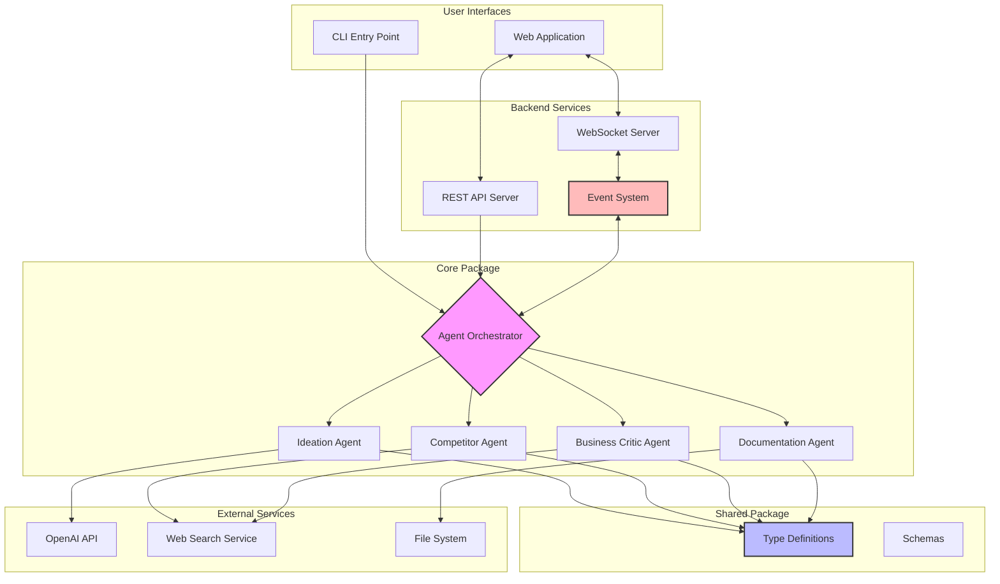
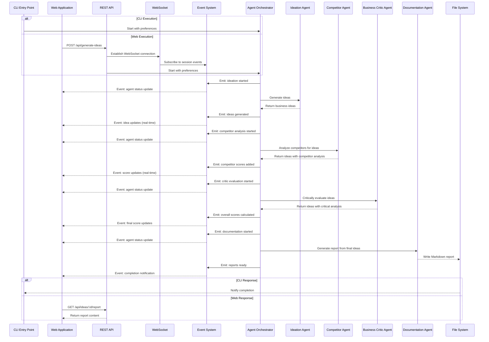
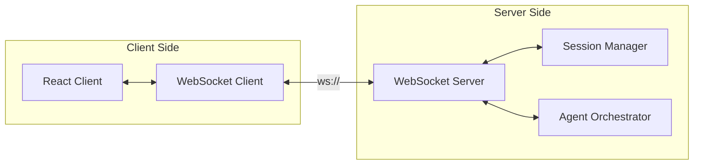
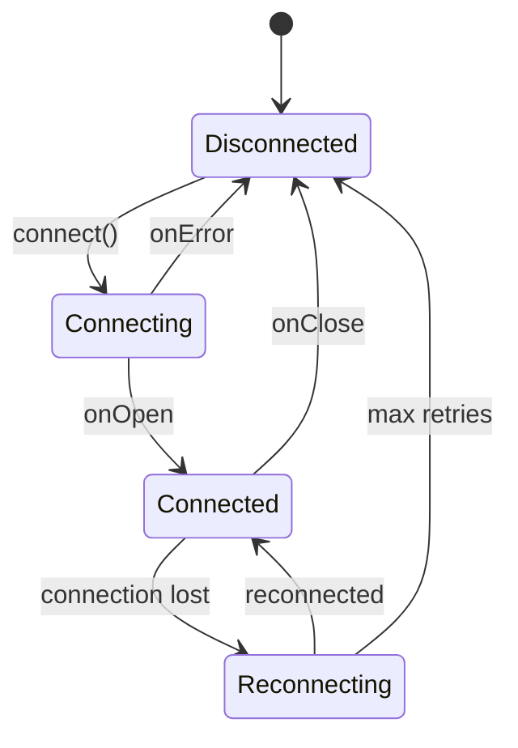
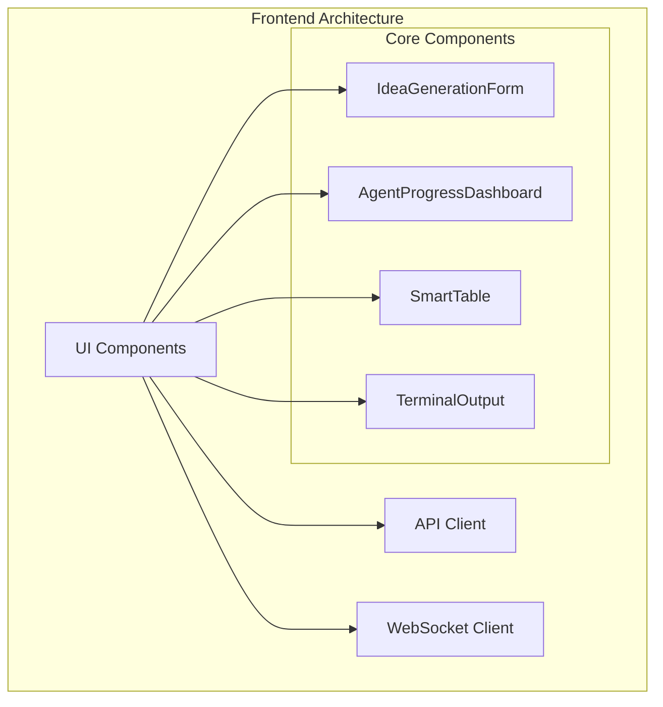

# Business Idea Generator - Architecture Documentation

## Document Overview

This document defines the technical architecture for the Business Idea Generator, a sequential multi-agent AI system that generates and evaluates business ideas. The project is organized as a monorepo with separate packages for core functionality, shared types, and web interface, enabling both CLI and web-based interactions.

## System Overview

### Purpose
The Business Idea Generator is a multi-interface application that demonstrates a sequential multi-agent pattern using the OpenAI Agents SDK for TypeScript. The system processes business preferences through four specialized agents to produce ranked business ideas with comprehensive analysis, accessible via both command-line interface and web application.

### Key Characteristics
- **Architecture Pattern**: Monorepo with separated concerns
- **Agent Pattern**: Deterministic multi-agent orchestration
- **Execution Models**: Command-line interface (CLI) and Web Application
- **Agent Flow**: Orchestrated sequence of 4 specialized agents
- **Package Structure**: Core business logic, shared types, and web UI
- **Output Format**: Structured Markdown reports and real-time web display

## Technology Stack

### Core Technologies
- **Runtime**: Node.js LTS (v22.x) - Latest stable version for modern JavaScript features
- **Language**: TypeScript 5.x - Type safety and modern language features
- **AI Framework**: OpenAI Agents SDK for TypeScript (latest) - Core agent capabilities
- **Model**: OpenAI o3 - High-capability language model for complex reasoning
- **Logging**: Comma-separated value (CSV) format for simple, structured logging

### Web Technologies
- **Framework**: React 18.3.1 with TypeScript 5.5.3
- **Build Tool**: Vite 5.4.1 for fast development and optimized production builds
- **UI Components**: shadcn/ui for consistent, accessible components
- **Styling**: Tailwind CSS 3.4.11 for utility-first styling
- **State Management**: Real-time state updates from WebSocket events

### Real-Time Communication
- **WebSocket**: For bi-directional real-time updates between frontend and backend
- **Server-Sent Events (SSE)**: Fallback option for real-time server-to-client communication
- **Event System**: Event emitter pattern for agent status updates and data streaming
- **Session Management**: WebSocket session handling with automatic reconnection

### Package Management & CI/CD
- **Monorepo Management**: npm workspaces for package orchestration
- **Package Manager**: npm with latest stable versions
- **CI/CD Pipeline**: GitHub Actions
- **Version Strategy**: Latest stable versions for all dependencies

### Development Tools
- **TypeScript Compiler**: Latest with strict type checking
- **ESLint**: For code quality and consistency
- **Node.js**: LTS version for stability and long-term support

## Monorepo Architecture

### Package Structure
```
business-idea-multi-agent/
├── packages/
│   ├── core/          # Core business logic and AI agents
│   │   ├── src/
│   │   │   ├── agents/
│   │   │   ├── orchestrator/
│   │   │   ├── schemas/
│   │   │   ├── services/
│   │   │   ├── types/
│   │   │   ├── utils/
│   │   │   └── main.ts
│   │   ├── package.json
│   │   └── tsconfig.json
│   ├── shared/        # Shared types and utilities
│   │   ├── src/
│   │   │   ├── types/
│   │   │   └── index.ts
│   │   ├── package.json
│   │   └── tsconfig.json
│   └── web/           # React web application
│       ├── src/
│       │   ├── components/
│       │   ├── pages/
│       │   ├── hooks/
│       │   └── main.tsx
│       ├── package.json
│       └── vite.config.ts
├── docs/              # Documentation and reports
├── package.json       # Root workspace configuration
└── README.md
```

### Package Dependencies


### Package Responsibilities

#### @business-idea/core
- **Purpose**: Core business logic and agent implementation
- **Contents**: All AI agents, orchestration logic, services, and utilities
- **Exports**: Main CLI entry point
- **Dependencies**: @business-idea/shared, OpenAI SDK, other runtime dependencies

#### @business-idea/shared
- **Purpose**: Shared types and interfaces
- **Contents**: BusinessIdea interface, BusinessPreferences, schemas
- **Exports**: Type definitions and schemas used across packages
- **Dependencies**: Minimal (only zod for schema validation)

#### @business-idea/web
- **Purpose**: Web application interface
- **Contents**: React components, pages, UI logic
- **Exports**: None (application package)
- **Dependencies**: @business-idea/shared, React ecosystem

## Architectural Patterns

### Deterministic Multi-Agent Pattern
The system implements a deterministic, code-orchestrated multi-agent pattern. The `AgentOrchestrator` is not an agent, but a TypeScript module that calls the specialized agents in a predefined sequence. It passes strongly-typed data objects between them, ensuring predictable execution flow and type safety without relying on agent-to-agent handoffs.

Each agent is a stateless function or class that receives input, performs its specialized task, and returns a structured output. The orchestrator is responsible for invoking each agent in the correct order and managing the overall state.

This pattern is based on the [deterministic agent example](https://github.com/openai/openai-agents-js/blob/main/examples/agent-patterns/deterministic.ts) from the OpenAI Agents SDK documentation.

## System Architecture

### High-Level Architecture


### Component Architecture

#### Core Components
1. **Entry Points** - CLI application bootstrap and web application entry
2. **Agent Orchestrator** - A TypeScript module that calls agents in sequence and manages data flow
3. **Agent Modules** - Specialized agents with distinct responsibilities
4. **Service Layer** - Logging, configuration, and external API management
5. **Output Handler** - Markdown report generation and file management
6. **Shared Types** - Common type definitions used across packages

#### Agent Specifications

**Ideation Agent**
- **Purpose**: Generate creative business ideas
- **Tools**: None (pure reasoning)
- **Input**: Business preferences (vertical, sub-vertical, business model)
- **Output**: 10 business ideas with initial scoring, as an `IdeationAgentOutput[]`
- **Integration Pattern**: The agent is invoked by the `AgentOrchestrator`, which passes the required `BusinessPreferences`. The agent returns a structured `IdeationAgentOutput[]` object.
- **Data Flow**: The output is passed back to the orchestrator, which then calls the `CompetitorAgent`.

**Competitor Agent**
- **Purpose**: Market research and competitive analysis
- **Tools**: OpenAI built-in `web_search` tool
- **Input**: Business ideas from Ideation Agent
- **Output**: Enhanced ideas with competitive analysis and Blue Ocean scores

**Business Critic Agent**
- **Purpose**: Critical evaluation and risk assessment
- **Tools**: OpenAI built-in `web_search` tool
- **Input**: Business ideas with competitive analysis
- **Output**: Final evaluation with Overall scores

**Documentation Agent**
- **Purpose**: Report synthesis and formatting
- **Tools**: None (document generation)
- **Input**: Fully analyzed business ideas
- **Output**: Structured Markdown report

## Application Structure

### Module Organization

#### Agent-Based Modules
Each agent is organized as a self-contained module within the core package:
- **Agent Implementation**: Core agent logic and instructions
- **Schema Definitions**: Agent-specific Zod schemas
- **Configuration**: Agent-specific settings and parameters

#### Service Layer
- **Logging Service**: Simple CSV-based logger
- **Configuration Service**: Environment variable management
- **Test Cache Service**: Development optimization for agent outputs
- **External APIs**: Web search and OpenAI API integration
- **Event Service**: Event emission and WebSocket communication
- **Session Service**: WebSocket session management and lifecycle

#### Backend API Layer
- **REST API Server**: HTTP endpoints for idea generation and report retrieval
- **WebSocket Server**: Real-time bidirectional communication
- **Event Emitter**: Publishes agent events to connected clients
- **Session Manager**: Tracks active WebSocket connections

#### Type System
- **Shared Types** (`@business-idea/shared`): Core data structures shared across packages
- **Business Idea Types**: Core data structures for business ideas
- **Preference Types**: Input preference definitions
- **Agent Types**: Agent-specific interfaces and structured outputs
- **Event Types**: Real-time event definitions for WebSocket communication

## Data Flow Architecture

### Sequential Processing Flow


### Data Models

#### Phase 1: Simplified Core Models

##### Business Idea
```typescript
interface BusinessIdea {
  id: string;
  title: string;
  description: string;
  businessModel: string;
  scores: {
    disruption: number;     // 0-10
    market: number;         // 0-10
    technical: number;      // 0-10
    capital: number;        // 0-10
    blueOcean: number;      // 0-10
    overall: number;        // 0-10
  };
  reasoning: {
    [key: string]: string;  // Flexible reasoning storage
  };
  competitorAnalysis?: string;
  criticalAnalysis?: string;
  createdAt: number;
  sessionId: string;
}
```

##### User Preferences
```typescript
interface BusinessPreferences {
  vertical: string;
  subVertical: string;
  businessModel: string;
  additionalContext?: string;
}
```

##### Session (In-Memory)
```typescript
interface Session {
  id: string;
  userId?: string;  // Optional for Phase 1
  preferences: BusinessPreferences;
  status: 'active' | 'completed' | 'error';
  createdAt: number;
  ideas: BusinessIdea[];
}
```

#### Real-Time Event Models

##### WebSocket Messages
```typescript
// Client to Server
interface ClientMessage {
  type: 'start' | 'stop' | 'ping';
  sessionId?: string;
  data?: any;
}

// Server to Client
interface ServerEvent {
  type: 'agent.started' | 'agent.progress' | 'agent.completed' |
        'idea.generated' | 'error' | 'pong';
  agent?: string;
  data: any;
  timestamp: number;
}
```

##### Progress Updates
```typescript
interface ProgressEvent {
  agent: string;
  progress: number;     // 0-100
  message: string;
  currentStep?: string;
}
```

#### Phase 2: Extended Models (Future)
- Add user authentication models
- Implement persistent session storage
- Add analytics and metrics tracking
- Extend with team collaboration features
- Add versioning and audit trails

## Real-Time Communication Architecture

### WebSocket Implementation
Simple WebSocket connection for real-time updates using native `ws` library:



### Connection Management
- **Establishment**: WebSocket handshake via `/ws` endpoint
- **Authentication**: Session token passed in connection query params
- **Heartbeat**: Ping/pong every 30 seconds to maintain connection
- **Reconnection**: Automatic retry with exponential backoff (1s, 2s, 4s, 8s, max 30s)

### Simple Message Protocol
```typescript
// Client to Server
interface ClientMessage {
  type: 'start' | 'cancel' | 'ping';
  sessionId: string;
  data?: any;
}

// Server to Client
interface ServerEvent {
  type: 'agent.started' | 'agent.progress' | 'agent.completed' |
        'idea.generated' | 'error' | 'pong';
  agent?: string;
  data: any;
  timestamp: number;
}
```

### Progress Updates
```typescript
interface ProgressEvent {
  agent: string;
  progress: number;     // 0-100
  message: string;
  currentStep?: string;
}
```

### Connection States


*Note: Advanced features like SSE fallback, event replay, and complex routing will be added in Phase 2*
## Session Management

### Lightweight In-Memory Sessions
Simple session management using JavaScript Map for Phase 1:

```typescript
// In-memory session store
class SessionManager {
  private sessions = new Map<string, Session>();
  private userSessions = new Map<string, Set<string>>(); // userId -> sessionIds
  
  createSession(userId: string, preferences: BusinessPreferences): Session {
    const session: Session = {
      id: crypto.randomUUID(),
      userId,
      preferences,
      status: 'active',
      createdAt: Date.now(),
      ideas: []
    };
    
    this.sessions.set(session.id, session);
    
    // Track user sessions
    if (!this.userSessions.has(userId)) {
      this.userSessions.set(userId, new Set());
    }
    this.userSessions.get(userId)!.add(session.id);
    
    return session;
  }
  
  getSession(sessionId: string): Session | null {
    return this.sessions.get(sessionId) || null;
  }
  
  updateSession(sessionId: string, updates: Partial<Session>): void {
    const session = this.sessions.get(sessionId);
    if (session) {
      Object.assign(session, updates);
    }
  }
  
  // Periodic cleanup of old sessions
  cleanup(): void {
    const now = Date.now();
    const maxAge = 2 * 60 * 60 * 1000; // 2 hours
    
    for (const [id, session] of this.sessions) {
      if (now - session.createdAt > maxAge) {
        this.sessions.delete(id);
        if (session.userId) {
          this.userSessions.get(session.userId)?.delete(id);
        }
      }
    }
  }
}
```

### Session Lifecycle (Phase 1)
- **Creation**: New session created when user starts generation
- **Active**: Session tracks progress during generation
- **Completion**: Session marked complete when generation finishes
- **Cleanup**: Old sessions removed from memory periodically

*Note: Persistence and recovery features planned for Phase 2 when database is added*


## Security Guidelines

### Lightweight Security for Phase 1
Simple but effective security using JWT and in-memory storage:

#### Authentication & Authorization
- **JWT Tokens**: For both REST API and WebSocket authentication
- **In-Memory User Store**: Basic user management for Phase 1
- **Rate Limiting**: Simple in-memory rate limiting (10 req/min per IP)

```typescript
// Basic JWT payload structure
interface JWTPayload {
  userId: string;
  email: string;
  role: 'user' | 'admin';
  iat: number;
  exp: number;
}

// In-memory user store
const users = new Map<string, User>();
```

#### Basic Security Measures
- **HTTPS Only**: Use TLS for production
- **WSS for WebSocket**: Secure WebSocket connections
- **Input Validation**: Zod schemas for all inputs
- **CORS Configuration**: Allow only trusted origins

```typescript
// Fastify CORS config
await app.register(cors, {
  origin: (origin, cb) => {
    const allowedOrigins = ['http://localhost:3000'];
    cb(null, allowedOrigins.includes(origin));
  },
  credentials: true
});
```

#### Secrets Management (Phase 1)
- **Environment Variables**: All secrets in `.env` file
- **JWT Secret**: Strong random string for signing tokens
- **API Keys**: Simple string tokens for service access

```bash
# .env file
JWT_SECRET=your-super-secret-jwt-key
NODE_ENV=development
PORT=4000
```

#### Error Handling
- **Generic Error Messages**: Don't expose internal details
- **Basic Logging**: Console logging for development
- **Error Codes**: Standardized error responses

```typescript
// Standard error response
{
  error: {
    code: 'AUTH_FAILED',
    message: 'Authentication failed'
  }
}
```

*Note: Advanced features like database persistence, OAuth, and monitoring will be added in Phase 2*

## Backend API Architecture

### RESTful API Design
The backend exposes a comprehensive REST API following OpenAPI 3.0 specification:

```yaml
openapi: 3.0.0
info:
  title: Business Idea Generator API
  version: 2.0.0
paths:
  /api/health:
    get:
      summary: Health check endpoint
      responses:
        '200':
          description: Service is healthy
  
  /api/generate-ideas:
    post:
      summary: Generate business ideas
      requestBody:
        required: true
        content:
          application/json:
            schema:
              $ref: '#/components/schemas/BusinessPreferences'
      responses:
        '200':
          description: Generation started
          content:
            application/json:
              schema:
                type: object
                properties:
                  sessionId: string
                  webSocketUrl: string
  
  /api/ideas/{sessionId}:
    get:
      summary: Get ideas for a session
      parameters:
        - name: sessionId
          in: path
          required: true
          schema:
            type: string
      responses:
        '200':
          description: Ideas retrieved
          content:
            application/json:
              schema:
                type: array
                items:
                  $ref: '#/components/schemas/BusinessIdea'
  
  /api/ideas/{sessionId}/report:
    get:
      summary: Get markdown report
      parameters:
        - name: sessionId
          in: path
          required: true
          schema:
            type: string
      responses:
        '200':
          description: Report retrieved
          content:
            text/markdown:
              schema:
                type: string
```

### API Routing Architecture
```typescript
// packages/business-idea-api/src/routes/index.ts
export const routes = {
  health: '/api/health',
  generateIdeas: '/api/generate-ideas',
  getIdeas: '/api/ideas/:sessionId',
  getReport: '/api/ideas/:sessionId/report',
  websocket: '/ws',
  events: '/api/events/:sessionId' // SSE fallback
};
```

### Middleware Stack
Request processing follows this order:
1. **CORS Middleware**: Cross-origin request handling
2. **Authentication Middleware**: JWT/API key validation
3. **Rate Limiting Middleware**: Request throttling
4. **Request Validation**: Zod schema validation
5. **Error Handling**: Centralized error processing
6. **Response Compression**: Gzip/Brotli compression

### Controller Architecture
```typescript
// Domain-driven controller structure
interface ControllerBase {
  // RESTful operations
  create(req: Request, res: Response): Promise<void>;
  read(req: Request, res: Response): Promise<void>;
  update(req: Request, res: Response): Promise<void>;
  delete(req: Request, res: Response): Promise<void>;
  
  // WebSocket upgrade
  upgrade?(req: Request, socket: Socket): void;
}

// Example implementation
class IdeaGenerationController implements ControllerBase {
  constructor(
    private orchestrator: AgentOrchestrator,
    private sessionManager: SessionManager,
    private eventSystem: EventSystem
  ) {}
  
  async create(req: Request, res: Response) {
    const preferences = validatePreferences(req.body);
    const sessionId = await this.sessionManager.createSession();
    
    // Start async generation
    this.orchestrator.generate(preferences, sessionId)
      .then(ideas => this.eventSystem.emit('generation.completed', { sessionId, ideas }))
      .catch(error => this.eventSystem.emit('generation.failed', { sessionId, error }));
    
    res.json({
      sessionId,
      webSocketUrl: `/ws?session=${sessionId}`,
      fallbackUrl: `/api/events/${sessionId}`
    });
  }
}
```

### Service Layer Architecture
Services encapsulate business logic and external integrations:

```typescript
// Service interfaces
interface IdeaGenerationService {
  generateIdeas(preferences: BusinessPreferences): Promise<BusinessIdea[]>;
}

interface ReportService {
  generateReport(ideas: BusinessIdea[]): Promise<string>;
}

interface CacheService {
  get<T>(key: string): Promise<T | null>;
  set<T>(key: string, value: T, ttl?: number): Promise<void>;
}

// Dependency injection
const container = new DIContainer();
container.register('ideaService', IdeaGenerationService);
container.register('reportService', ReportService);
container.register('cacheService', InMemoryCacheService);
```

### API Versioning Strategy
- **URL Versioning**: `/api/v2/generate-ideas`
- **Header Versioning**: `Accept: application/vnd.api+json;version=2`
- **Backward Compatibility**: v1 endpoints maintained for 6 months
- **Deprecation Notices**: Via `Sunset` HTTP header

### Response Formats
All API responses follow consistent structure:

```typescript
// Success response
interface ApiResponse<T> {
  success: true;
  data: T;
  metadata?: {
    timestamp: number;
    version: string;
    requestId: string;
  };
}

// Error response
interface ApiError {
  success: false;
  error: {
    code: string;
    message: string;
    details?: any;
    timestamp: number;
    requestId: string;
  };
}
```

### Pagination & Filtering
For list endpoints:
```typescript
interface PaginatedResponse<T> {
  data: T[];
  pagination: {
    page: number;
    limit: number;
    total: number;
    hasNext: boolean;
    hasPrev: boolean;
  };
  filters?: Record<string, any>;
}
```

## Frontend Architecture

### Overview
The v2.0 web application utilizes a React-based Single Page Application (SPA) built with Vite. The existing frontend implementation in `packages/web` contains static components that will be made dynamic by connecting them to the backend API and WebSocket events.

### Technology Stack (Based on Existing Implementation)
- **Framework**: React 18.3.1 with TypeScript 5.5.3
- **Build Tool**: Vite 5.4.1 for fast development and optimized builds
- **Styling**: Tailwind CSS 3.4.11 with shadcn/ui components
- **State Management**: React hooks and Context API (lightweight approach)
- **Real-time**: Native WebSocket API for event streaming
- **Routing**: React Router DOM 6.26.2
- **Forms**: React Hook Form 7.53.0 with Zod 3.23.8 validation
- **Data Fetching**: TanStack Query 5.56.2 for server state management

### Frontend Architecture Pattern


### Existing Component Structure

The frontend follows a simple, pragmatic structure:
```
packages/web/src/
├── components/           # React components
│   ├── ui/              # shadcn/ui components
│   ├── IdeaGenerationForm.tsx
│   ├── AgentProgressDashboard.tsx
│   ├── SmartTable.tsx
│   └── TerminalOutput.tsx
├── hooks/               # Custom React hooks
│   ├── use-mobile.tsx
│   └── use-toast.ts
├── lib/                 # Utilities
│   └── utils.ts
├── pages/               # Page components
│   ├── Index.tsx
│   └── NotFound.tsx
├── App.tsx              # Main app component
├── main.tsx             # Entry point
└── index.css            # Global styles
```

### Making Static Components Dynamic

The existing frontend in [`packages/web`](packages/web) contains well-structured static components that need to be connected to the backend API and WebSocket events. The approach is to maintain the existing component structure while adding dynamic behavior.

#### Existing Components Overview
- [`IdeaGenerationForm.tsx`](packages/web/src/components/IdeaGenerationForm.tsx) - Form for business preferences input
- [`AgentProgressDashboard.tsx`](packages/web/src/components/AgentProgressDashboard.tsx) - Real-time agent status display
- [`SmartTable.tsx`](packages/web/src/components/SmartTable.tsx) - Data table for displaying ideas
- [`TerminalOutput.tsx`](packages/web/src/components/TerminalOutput.tsx) - Live log streaming display

### State Management (Phase 1)

For the lightweight Phase 1 implementation, we use React's built-in state management:

#### Component State Pattern
```typescript
// Simple state management using React hooks
function IdeaGenerationForm() {
  const [preferences, setPreferences] = useState<BusinessPreferences>({
    industries: [],
    targetMarket: '',
    budget: '',
    timeToMarket: '',
    // ... other fields
  });
  
  const [isSubmitting, setIsSubmitting] = useState(false);
  
  const handleSubmit = async (e: React.FormEvent) => {
    e.preventDefault();
    setIsSubmitting(true);
    
    try {
      const response = await fetch('/api/sessions', {
        method: 'POST',
        headers: {
          'Content-Type': 'application/json',
          'Authorization': `Bearer ${localStorage.getItem('token')}`
        },
        body: JSON.stringify({ preferences })
      });
      
      const { sessionId } = await response.json();
      // Navigate to generation page with sessionId
    } catch (error) {
      console.error('Failed to start generation:', error);
    } finally {
      setIsSubmitting(false);
    }
  };
  
  // ... rest of component
}
```

#### WebSocket Connection Management
```typescript
// Simple WebSocket hook
function useWebSocket(sessionId: string) {
  const [ws, setWs] = useState<WebSocket | null>(null);
  const [status, setStatus] = useState<'connecting' | 'connected' | 'disconnected'>('disconnected');
  
  useEffect(() => {
    if (!sessionId) return;
    
    const websocket = new WebSocket(`ws://localhost:3000/ws?sessionId=${sessionId}`);
    
    websocket.onopen = () => {
      setStatus('connected');
      setWs(websocket);
    };
    
    websocket.onclose = () => {
      setStatus('disconnected');
      setWs(null);
    };
    
    websocket.onerror = (error) => {
      console.error('WebSocket error:', error);
    };
    
    return () => {
      websocket.close();
    };
  }, [sessionId]);
  
  return { ws, status };
}
```

#### Real-Time Updates Pattern
```typescript
// Component that receives real-time updates
function AgentProgressDashboard({ sessionId }: { sessionId: string }) {
  const { ws } = useWebSocket(sessionId);
  const [agents, setAgents] = useState<AgentStatus[]>([]);
  const [logs, setLogs] = useState<LogEntry[]>([]);
  
  useEffect(() => {
    if (!ws) return;
    
    ws.onmessage = (event) => {
      const message = JSON.parse(event.data);
      
      switch (message.type) {
        case 'agent.started':
          setAgents(prev => [...prev, {
            name: message.agentName,
            status: 'running',
            startTime: message.timestamp
          }]);
          break;
          
        case 'agent.completed':
          setAgents(prev => prev.map(agent =>
            agent.name === message.agentName
              ? { ...agent, status: 'completed', endTime: message.timestamp }
              : agent
          ));
          break;
          
        case 'log':
          setLogs(prev => [...prev, {
            timestamp: message.timestamp,
            level: message.level,
            message: message.message
          }]);
          break;
      }
    };
  }, [ws]);
  
  return (
    <div>
      {/* Render agent status cards */}
      {/* Render terminal output */}
    </div>
  );
}
```

### API Integration

#### Simple Fetch Wrapper
```typescript
// Lightweight API client
const api = {
  baseURL: process.env.REACT_APP_API_URL || 'http://localhost:3000',
  
  async request(path: string, options: RequestInit = {}) {
    const token = localStorage.getItem('token');
    
    const response = await fetch(`${this.baseURL}${path}`, {
      ...options,
      headers: {
        'Content-Type': 'application/json',
        ...(token && { 'Authorization': `Bearer ${token}` }),
        ...options.headers,
      },
    });
    
    if (!response.ok) {
      throw new Error(`API Error: ${response.statusText}`);
    }
    
    return response.json();
  },
  
  // Convenience methods
  get: (path: string) => api.request(path),
  post: (path: string, data: any) => api.request(path, {
    method: 'POST',
    body: JSON.stringify(data)
  }),
  put: (path: string, data: any) => api.request(path, {
    method: 'PUT',
    body: JSON.stringify(data)
  }),
  delete: (path: string) => api.request(path, { method: 'DELETE' }),
};
```

### Authentication Flow

#### Simple JWT Authentication
```typescript
// Login component
function LoginForm() {
  const [credentials, setCredentials] = useState({ email: '', password: '' });
  
  const handleLogin = async (e: React.FormEvent) => {
    e.preventDefault();
    
    try {
      const { token, user } = await api.post('/api/auth/login', credentials);
      
      // Store token
      localStorage.setItem('token', token);
      localStorage.setItem('user', JSON.stringify(user));
      
      // Redirect to dashboard
      window.location.href = '/dashboard';
    } catch (error) {
      console.error('Login failed:', error);
    }
  };
  
  // ... form JSX
}

// Auth context for protecting routes
const AuthContext = React.createContext<{
  user: User | null;
  isAuthenticated: boolean;
}>({ user: null, isAuthenticated: false });

function AuthProvider({ children }: { children: React.ReactNode }) {
  const [user, setUser] = useState<User | null>(() => {
    const stored = localStorage.getItem('user');
    return stored ? JSON.parse(stored) : null;
  });
  
  return (
    <AuthContext.Provider value={{ user, isAuthenticated: !!user }}>
      {children}
    </AuthContext.Provider>
  );
}
```

### Error Handling

#### Simple Error Boundary
```typescript
class ErrorBoundary extends React.Component<
  { children: React.ReactNode },
  { hasError: boolean; error: Error | null }
> {
  state = { hasError: false, error: null };
  
  static getDerivedStateFromError(error: Error) {
    return { hasError: true, error };
  }
  
  componentDidCatch(error: Error, errorInfo: React.ErrorInfo) {
    console.error('Error caught by boundary:', error, errorInfo);
  }
  
  render() {
    if (this.state.hasError) {
      return (
        <div className="error-fallback">
          <h2>Something went wrong</h2>
          <pre>{this.state.error?.message}</pre>
          <button onClick={() => window.location.reload()}>
            Reload Page
          </button>
        </div>
      );
    }
    
    return this.props.children;
  }
}
```

### Phase 1 Implementation Guidelines

1. **Start Simple**: Use React's built-in state management before adding external libraries
2. **Direct API Calls**: Use fetch or a simple wrapper, avoid complex caching initially
3. **Native WebSocket**: Use the browser's WebSocket API directly
4. **Progressive Enhancement**: Add features incrementally as needed
5. **Focus on Core Functionality**: Get the basic flow working before optimizing

### Future Enhancements (Phase 2)

Once the basic implementation is stable, consider:
- State management library (Zustand, Jotai) if component prop drilling becomes problematic
- React Query for advanced caching and synchronization
- WebSocket reconnection strategies
- Optimistic UI updates
- Offline support


## Testing Strategy

### Current Approach
- **Build Testing**: TypeScript compilation ensures type safety
- **Manual Testing**: End-to-end execution validation
- **Test Cache Service**: Speeds up development iteration
- **Error Scenario Testing**: Manual verification of error handling

### Manual Testing Checklist
1. **Successful Execution**: Complete agent workflow execution
2. **Error Handling**: API failures, network issues, invalid configurations
3. **Output Validation**: Markdown report generation and formatting
4. **Performance**: Execution time and resource usage monitoring
5. **Cross-package Integration**: Verify shared types work correctly

## Monitoring and Observability

### Phase 1: Simple Console Logging
Basic logging for development and debugging:

```typescript
// Simple logger utility
const logger = {
  error: (message: string, error?: any) => {
    console.error(`[ERROR] ${new Date().toISOString()} - ${message}`, error);
  },
  info: (message: string, data?: any) => {
    console.log(`[INFO] ${new Date().toISOString()} - ${message}`, data);
  },
  debug: (message: string, data?: any) => {
    if (process.env.DEBUG) {
      console.log(`[DEBUG] ${new Date().toISOString()} - ${message}`, data);
    }
  }
};
```

### Error Handling
- **API Failures**: Log and return user-friendly error messages
- **Validation Errors**: Return specific field errors to client
- **System Errors**: Log full details, return generic message to user

*Note: Advanced monitoring, metrics collection, and log aggregation will be added in Phase 2*

## Deployment Architecture

### Phase 1: Local Development Only
Simple development setup for rapid prototyping:

#### Environment Setup
```bash
# Clone repository
git clone <repository-url>
cd business-idea-multi-agent

# Install dependencies
npm install

# Create .env file
cp .env.example .env
# Add your OpenAI/Anthropic API key to .env
```

#### Running the Application
```bash
# Start backend API
npm run dev:api

# In another terminal, start web frontend
npm run dev:web

# Access at http://localhost:5173
```

### Phase 2: Production Deployment (Future)
- **Frontend**: Static site hosting (Vercel, Netlify)
- **Backend**: Containerized API on cloud platform
- **Database**: Managed PostgreSQL instance
- **CI/CD**: Automated testing and deployment pipelines

*Note: Phase 1 focuses on local development. Production deployment strategies will be defined when moving to Phase 2.*

## Development Workflow

### Working with the Monorepo
1. **Install Dependencies**: `npm install` at root installs all workspace dependencies
2. **Build Order**: Shared → Core → Web (handled automatically by npm workspaces)
3. **Development Mode**: 
   - CLI: `npm run start:core`
   - Web: `npm run dev:web`
4. **Type Safety**: Changes to shared types immediately affect dependent packages

### Inter-package Development
- **Shared Types**: Modify in `packages/shared`, rebuild, then update consumers
- **Hot Reload**: Web development server auto-reloads on shared type changes
- **Type Checking**: `npm run build` validates all cross-package dependencies

## Conclusion

This architecture provides a scalable foundation for the Business Idea Generator, with clear separation between core business logic, shared types, and user interfaces. The monorepo structure enables:

1. **Code Reusability**: Shared types ensure consistency across interfaces
2. **Independent Development**: Teams can work on web/core packages separately
3. **Type Safety**: Cross-package type checking catches integration issues early
4. **Flexible Deployment**: Packages can be deployed independently as needed

The deterministic, code-orchestrated multi-agent pattern enables sophisticated business idea analysis while maintaining development velocity and predictability.

---

*This architecture document serves as the technical blueprint for the Business Idea Generator implementation. It should be reviewed and updated as the system evolves through the development process.*