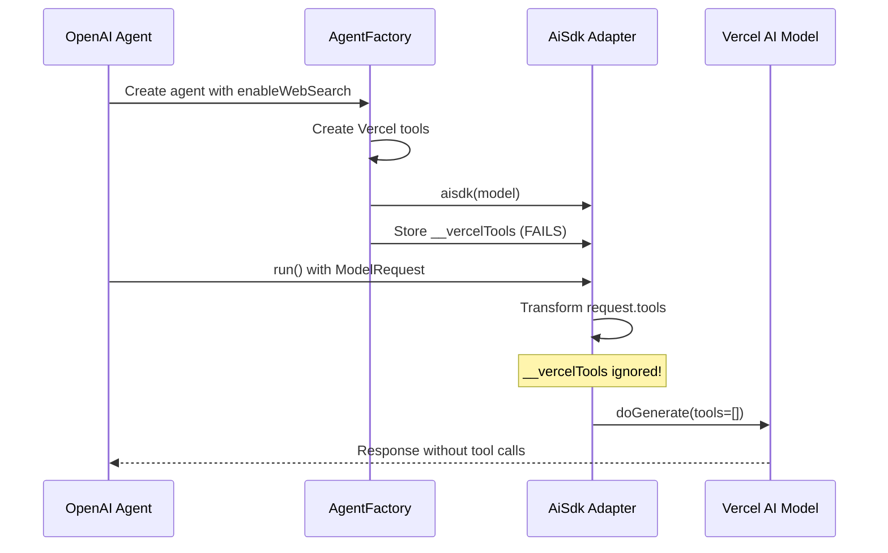

# Architecture Analysis: Web Search Tool Integration in Multi-Provider Agent System

## Executive Summary

This document provides a comprehensive technical analysis of integrating provider-specific web search tools in a multi-provider agent system using the OpenAI Agents SDK with the Vercel AI SDK adapter. The current implementation faces a fundamental architectural mismatch where provider-specific tools (like Anthropic's web search) are not being invoked despite correct model selection and configuration.

## System Context

### Technology Stack
- **OpenAI Agents SDK** (`@openai/agents`): Primary agent framework
- **Vercel AI SDK** (`ai`, `@ai-sdk/*`): Multi-provider language model support
- **AiSdk Adapter** (`@openai/agents-extensions`): Bridge between OpenAI Agents SDK and Vercel AI SDK

### Current Problem Statement

The agent successfully calls the correct model (e.g., Anthropic Sonnet) but the model is **NOT** making web search tool calls. The current approach attempts to store Vercel tools on the adapted model as a workaround:

```typescript
const adaptedModel = aisdk(model);
(adaptedModel as any).__vercelTools = vercelTools;
```

However, `__vercelTools` is not part of the `AiSdkModel` type definition, and this approach fails to enable tool calling.

## Component Architecture

### 1. OpenAI Agents SDK Model Interface

The OpenAI Agents SDK defines a `Model` interface with the following key characteristics:

```typescript
interface Model {
  getResponse(request: ModelRequest): Promise<ModelResponse>;
  getStreamedResponse(request: ModelRequest): AsyncIterable<StreamEvent>;
}
```

The `ModelRequest` includes:
- `tools: SerializedTool[]` - Array of tools available to the model
- `systemInstructions?: string` - System prompt
- `input: string | AgentInputItem[]` - User input
- `modelSettings: ModelSettings` - Configuration parameters

### 2. AiSdk Adapter Implementation

The `aisdk` adapter from `@openai/agents-extensions` creates an `AiSdkModel` class that:

1. **Receives tools via ModelRequest**: The adapter's `getResponse` method receives tools through `request.tools`
2. **Transforms tools**: Converts OpenAI Agents SDK tools to Vercel AI SDK format using `toolToLanguageV2Tool()`
3. **Passes tools to underlying model**: Includes transformed tools in the `doGenerate()` call

Key implementation detail from `aiSdk.js`:
```javascript
const tools = request.tools.map((tool) => toolToLanguageV2Tool(this.#model, tool));
const aiSdkRequest = {
    tools,
    prompt: input,
    // ... other parameters
};
const result = await this.#model.doGenerate(aiSdkRequest);
```

### 3. Vercel AI SDK Tool Types

Vercel AI SDK supports two types of tools:

#### a. Function Tools (`LanguageModelV2FunctionTool`)
```typescript
type LanguageModelV2FunctionTool = {
    type: 'function';
    name: string;
    description?: string;
    inputSchema: JSONSchema7;
}
```

#### b. Provider-Defined Tools (`LanguageModelV2ProviderDefinedTool`)
```typescript
type LanguageModelV2ProviderDefinedTool = {
    type: 'provider-defined';
    id: `${string}.${string}`;  // e.g., "anthropic.web_search"
    name: string;
    args: Record<string, unknown>;
}
```

### 4. Anthropic Web Search Tool

Anthropic provides web search as a provider-defined tool:
```typescript
anthropic.tools.webSearch_20250305({
    maxUses: 15,
    allowedDomains?: string[],
    blockedDomains?: string[]
})
```

## Data Flow Analysis

### Current (Broken) Flow



### Root Cause Analysis

The fundamental issue is a **tool system mismatch**:

1. **OpenAI Agents SDK expects tools in Agent constructor**: Tools are passed when creating an Agent instance
2. **Vercel provider-defined tools are model-specific**: They exist on the provider (e.g., `anthropic.tools`)
3. **The adapter only transforms function tools**: Provider-defined tools require special handling

## Architectural Solutions

### Solution 1: Tool Injection at Agent Level (Recommended)

Transform provider-specific tools into OpenAI Agents SDK format at the Agent creation level:

```typescript
class AgentFactory {
  static createAgent(config: AgentFactoryConfig, apiKey: string): Agent {
    const tools: Tool[] = [];
    
    if (config.enableWebSearch && config.provider === 'anthropic') {
      // Convert Anthropic web search to OpenAI Agents SDK tool
      tools.push({
        type: 'hosted_tool',
        name: 'web_search',
        providerData: {
          provider: 'anthropic',
          toolId: 'anthropic.webSearch_20250305',
          args: { maxUses: 15 }
        }
      });
    }
    
    return new Agent({
      name: config.name,
      instructions: config.instructions,
      model: aisdk(model),
      tools // Pass tools here, not to the model
    });
  }
}
```

### Solution 2: Custom Adapter with Provider Tool Support

Extend the `aisdk` adapter to handle provider-defined tools:

```typescript
class ExtendedAiSdkModel extends AiSdkModel {
  private providerTools: Map<string, LanguageModelV2ProviderDefinedTool>;
  
  async getResponse(request: ModelRequest): Promise<ModelResponse> {
    // Merge OpenAI tools with provider tools
    const mergedRequest = {
      ...request,
      tools: [
        ...request.tools,
        ...this.providerTools.values()
      ]
    };
    
    return super.getResponse(mergedRequest);
  }
}
```

### Solution 3: Tool Transformation Pipeline

Create a transformation layer that converts between tool formats:

```typescript
interface ToolTransformer {
  toOpenAIFormat(tool: VercelTool): SerializedTool;
  toVercelFormat(tool: SerializedTool): LanguageModelV2Tool;
  supportsProviderTool(provider: string, toolName: string): boolean;
}
```

## Key Findings

### 1. Tool Format Incompatibility

- **OpenAI Agents SDK tools**: `function`, `hosted_tool`, `computer`
- **Vercel AI SDK tools**: `function`, `provider-defined`
- The adapter's `toolToLanguageV2Tool()` handles `hosted_tool` by converting to `provider-defined`

### 2. Tool Passing Mechanism

Tools MUST be passed through the `ModelRequest.tools` property, not attached to the model instance. The `aisdk` adapter correctly reads from `request.tools` and transforms them.

### 3. Provider-Specific Tool Handling

The adapter implementation shows support for `hosted_tool` type, which maps to provider-defined tools:

```javascript
if (tool.type === 'hosted_tool') {
    return {
        type: 'provider-defined',
        id: `${model.provider}.${tool.name}`,
        name: tool.name,
        args: tool.providerData?.args ?? {},
    };
}
```

## Recommended Implementation

### Immediate Fix

Use the `hosted_tool` type in the OpenAI Agents SDK to represent provider-specific tools:

```typescript
const agent = new Agent({
  name: 'Competitor Agent',
  instructions: systemPrompt,
  model: aisdk(anthropicModel),
  tools: [
    {
      type: 'hosted_tool',
      name: 'web_search',
      providerData: {
        args: {
          maxUses: 15,
          allowedDomains: [],
          blockedDomains: []
        }
      }
    }
  ]
});
```

### Long-term Architecture

1. **Create a ProviderToolRegistry**: Centralize provider-specific tool definitions
2. **Implement ToolAdapterFactory**: Generate appropriate tool adapters per provider
3. **Add Tool Validation**: Ensure tools are compatible with selected provider
4. **Enable Tool Discovery**: Allow runtime discovery of available provider tools

## Security Considerations

1. **API Key Management**: Ensure provider API keys are properly isolated
2. **Tool Permission Control**: Implement granular permissions for tool usage
3. **Rate Limiting**: Respect provider-specific rate limits for tool calls
4. **Data Privacy**: Handle tool results according to data protection requirements

## Performance Optimization

1. **Tool Call Batching**: Group multiple tool calls when possible
2. **Response Caching**: Cache web search results for duplicate queries
3. **Streaming Support**: Ensure tool results can be streamed progressively
4. **Timeout Management**: Implement appropriate timeouts for tool execution

## Testing Strategy

### Unit Tests
- Tool transformation logic
- Provider detection and routing
- Error handling for unsupported tools

### Integration Tests
- End-to-end tool calling with different providers
- Tool result processing and formatting
- Multi-tool scenarios

### Provider-Specific Tests
- Anthropic web search functionality
- Google search integration (if available)
- OpenAI function calling

## Migration Path

1. **Phase 1**: Implement hosted_tool support for web search
2. **Phase 2**: Create tool registry and factory pattern
3. **Phase 3**: Add support for additional provider-specific tools
4. **Phase 4**: Implement tool discovery and dynamic registration

## Conclusion

The current architecture issue stems from attempting to attach Vercel tools directly to the model instance rather than passing them through the proper channels. The OpenAI Agents SDK and `aisdk` adapter already support the necessary infrastructure through the `hosted_tool` type, which maps to Vercel's `provider-defined` tools.

The recommended immediate fix is to:
1. Pass web search as a `hosted_tool` in the Agent constructor
2. Ensure the tool includes proper `providerData` with required arguments
3. Let the existing adapter handle the transformation to provider-defined format

This approach aligns with the existing architecture and requires minimal code changes while enabling full provider-specific tool functionality.