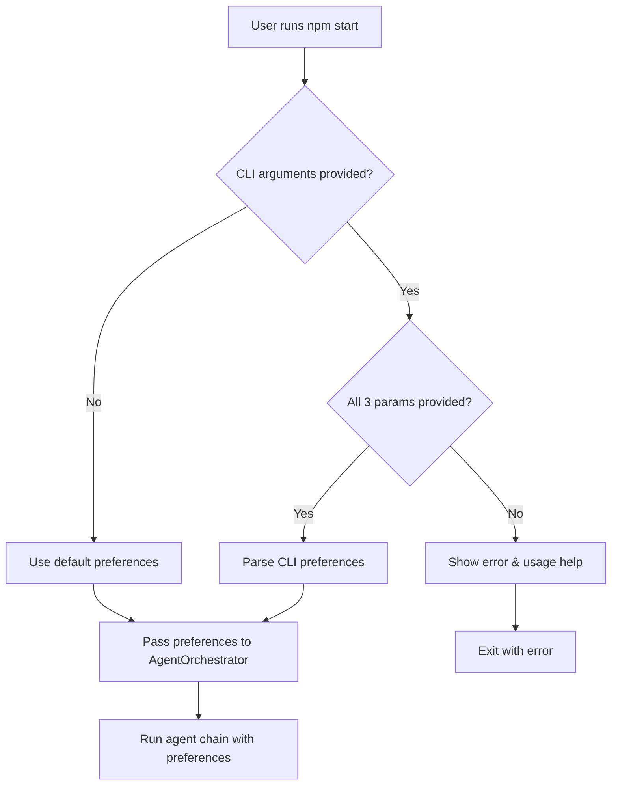

# CLI Parameter Refactoring Plan

## Overview
This plan outlines the refactoring of the business-idea-multi-agent application to accept CLI parameters for vertical, subvertical, and business model instead of hardcoding these values in the orchestrator.

## Current State
- Business preferences are hardcoded in `AgentOrchestrator.runChain()` method
- Values are set to:
  - vertical: 'Media & Entertainment'
  - subVertical: 'Digital Media and Content Creation'
  - businessModel: 'B2B SaaS'

## Proposed Changes

### 1. CLI Parameter Format
Use named flags format:
```bash
npm start --vertical "Media & Entertainment" --subvertical "Digital Media" --business-model "B2B SaaS"
```

### 2. Implementation Tasks

#### Task 1: Create CLI Argument Parser Utility
- Create a utility function to parse command-line arguments
- Support for --vertical, --subvertical, and --business-model flags
- Return parsed preferences or null if not all provided

#### Task 2: Update main.ts
- Import and use the CLI parser utility
- Validate that all three parameters are provided together or none
- Pass preferences to orchestrator

#### Task 3: Modify AgentOrchestrator
- Update `runChain()` method signature to accept `BusinessPreferences` parameter
- Remove hardcoded preferences from inside the method
- Use passed preferences instead

#### Task 4: Define Default Preferences
- Create a constant for default preferences
- Use current hardcoded values as defaults:
  ```typescript
  const DEFAULT_PREFERENCES: BusinessPreferences = {
    vertical: 'Media & Entertainment',
    subVertical: 'Digital Media and Content Creation',
    businessModel: 'B2B SaaS',
  };
  ```

#### Task 5: Update Orchestrator Usage
- Modify main.ts to pass either CLI-parsed or default preferences
- Ensure backward compatibility (no CLI args = use defaults)

#### Task 6: Add Usage Help
- Display help text when invalid arguments are provided
- Show example usage and available options

#### Task 7: Update Documentation
- Update README with CLI usage examples
- Document the new parameter options

#### Task 8: Testing
- Test with no arguments (should use defaults)
- Test with all three arguments provided
- Test with partial arguments (should show error)
- Test with --test-cache flag combination

## Usage Examples

### Default behavior (backward compatible):
```bash
npm start
```

### With custom parameters:
```bash
npm start --vertical "Healthcare" --subvertical "Digital Health" --business-model "B2C"
```

### With test cache:
```bash
npm start --test-cache --vertical "Healthcare" --subvertical "Digital Health" --business-model "B2C"
```

### Invalid usage (shows help):
```bash
npm start --vertical "Healthcare"  # Missing other parameters
```

## Flow Diagram



## Benefits
- Flexibility to test different business domains without code changes
- Maintains backward compatibility
- Clear error messages for invalid usage
- Follows standard CLI conventions with named flags